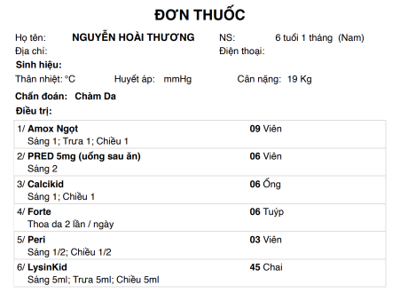

# Trợ Lý Y Tế AI — OCR Đơn Thuốc

Ứng dụng web cho phép người dùng chụp hoặc tải ảnh đơn thuốc lên, hệ thống tự động trích xuất văn bản bằng OCR, lưu lịch sử quét, tra cứu thông tin thuốc và gửi kết quả qua email.

---

## Đường link demo đến trang web 
https://prescription-ocr-project.onrender.com/ 

**Ảnh ví dụ:**




## Tính năng chính

- **OCR đơn thuốc** — Tải lên ảnh đơn lẻ hoặc hàng loạt; hệ thống xử lý đa biến thể ảnh và chọn kết quả tốt nhất
- **Đăng ký có OTP email** — Xác thực email bằng mã OTP 6 số, hết hạn sau 5 phút
- **Đăng nhập** bằng email/mật khẩu hoặc **Google OAuth**
- **Quên mật khẩu** qua OTP email
- **Lịch sử quét** — Lưu, đổi tên, xóa, xuất PDF, gửi kết quả qua email
- **Tra cứu thuốc** — Tìm kiếm thông tin từ bộ dữ liệu nội bộ (TF-IDF)
- **Hồ sơ người dùng** — Cập nhật thông tin cá nhân, tải lên và crop avatar
- **Dashboard thống kê** — Số lần quét, xu hướng theo thời gian
- **Admin panel** — Quản lý danh sách người dùng, kiểm tra sức khoẻ cơ sở dữ liệu
- **Dark / Light mode** với hiệu ứng animation (GSAP, neural network canvas)

---

## Tech Stack

| Tầng | Công nghệ |
|------|-----------|
| Frontend | HTML/CSS/JS thuần, TailwindCSS, Lucide Icons, GSAP, CropperJS, pdfmake, Google Sign-In |
| Backend | Python **Flask** |
| OCR | **Tesseract OCR** (pytesseract) + **OpenCV** (tiền xử lý ảnh) |
| Database | **SQLite** (mặc định) hoặc **SQL Server** (qua `pyodbc`) |
| Email | SMTP Gmail với `smtplib` |
| Auth | Flask session + Werkzeug password hash + Google OAuth2 |

---

## Yêu cầu hệ thống

- Python 3.10+
- [Tesseract OCR](https://github.com/UB-Mannheim/tesseract/wiki) (cài đặt và thêm vào PATH, cần gói ngôn ngữ `vie`)
- SQLite (mặc định) hoặc SQL Server với ODBC Driver 17+

---

## Cài đặt

### 1. Clone dự án

```bash
git clone <repository-url>
cd prescription_ocr_project
```

### 2. Tạo môi trường ảo và cài thư viện

```bash
python -m venv .venv
# Windows
.venv\Scripts\activate
# Linux/macOS
source .venv/bin/activate

pip install -r requirements.txt
```

### 3. Cấu hình biến môi trường

Tạo file `.env` tại thư mục gốc:

```env
# Database
DB_BACKEND=sqlite          # hoặc sqlserver

# SMTP (Gmail)
SMTP_HOST=smtp.gmail.com
SMTP_PORT=587
SMTP_USERNAME=your_email@gmail.com
SMTP_PASSWORD=your_app_password
SMTP_FROM=your_email@gmail.com

# Google OAuth
GOOGLE_CLIENT_ID=your_google_client_id

# Tesseract (bỏ trống nếu đã thêm vào PATH)
TESSERACT_CMD=C:/Program Files/Tesseract-OCR/tesseract.exe

# Chế độ dev: OTP trả về trong response khi SMTP lỗi
ALLOW_DEV_OTP_FALLBACK=true
```

### 4. Khởi tạo cơ sở dữ liệu

**SQLite (mặc định):**

```bash
python ops/init_db.py
```

**SQL Server:**

```bash
python ops/init_db_sqlserver.py
```

Hoặc chạy thủ công file `database/create_db_sqlserver.sql` trong SSMS.

### 5. Chạy ứng dụng

```bash
python backend/app.py
```

Mở trình duyệt tại `http://localhost:5000`

> Người dùng đầu tiên đăng ký sẽ tự động được gán vai trò **admin**.

---

## Cấu trúc dự án

```
prescription_ocr_project/
├── backend/
│   └── app.py              # Flask app, toàn bộ API endpoints
├── frontend/
│   ├── index.html          # Trang OCR chính
│   ├── login.html
│   ├── register.html
│   ├── history.html
│   ├── profile.html
│   ├── stats.html
│   └── ...
├── ocr/
│   └── ocr_engine.py       # Pipeline OCR (OpenCV + Tesseract)
├── ops/
│   ├── init_db.py          # Khởi tạo SQLite
│   ├── init_db_sqlserver.py
│   ├── db_backup.ps1
│   └── ...
├── database/
│   ├── create_db.sql
│   └── create_db_sqlserver.sql
├── uploads/
│   └── avatars/
├── requirements.txt
└── .env                    # Cấu hình (tự tạo)
```

---

## API Endpoints chính

### Auth
| Method | Endpoint | Mô tả |
|--------|----------|-------|
| POST | `/api/register/request-otp` | Gửi OTP đăng ký |
| POST | `/api/register/verify-otp` | Xác nhận OTP, tạo tài khoản |
| POST | `/api/login` | Đăng nhập email/mật khẩu |
| POST | `/api/login/google` | Đăng nhập Google |
| POST | `/api/logout` | Đăng xuất |
| POST | `/api/forgot-password` | Gửi OTP đặt lại mật khẩu |
| POST | `/api/reset-password` | Đặt mật khẩu mới |

### OCR
| Method | Endpoint | Mô tả |
|--------|----------|-------|
| POST | `/upload` | Tải lên và OCR 1 ảnh |
| POST | `/upload-batch` | Tải lên và OCR nhiều ảnh |

### Lịch sử
| Method | Endpoint | Mô tả |
|--------|----------|-------|
| GET | `/api/history` | Danh sách lịch sử (có phân trang, lọc) |
| POST | `/api/history` | Lưu kết quả OCR |
| PUT | `/api/history` | Đổi tên bản ghi |
| DELETE | `/api/history` | Xóa bản ghi |
| POST | `/api/history/send-email` | Gửi kết quả qua email |

### Hồ sơ & Thống kê
| Method | Endpoint | Mô tả |
|--------|----------|-------|
| GET/PUT | `/api/profile` | Xem/cập nhật hồ sơ |
| POST | `/api/profile/avatar` | Upload avatar |
| GET | `/api/stats/dashboard` | Dữ liệu thống kê |

---

## OCR Pipeline

1. Đọc ảnh bằng OpenCV (hỗ trợ đường dẫn Unicode)
2. Auto-crop tài liệu qua contour detection
3. Chỉnh nghiêng (deskew)
4. Resize lên tối thiểu 2200px
5. Tạo 8 biến thể ảnh (CLAHE, sharpen, Otsu, adaptive threshold, morphology, ...)
6. Chạy Tesseract với nhiều cấu hình PSM (4, 6, 11, 12) và 2 ngôn ngữ (`vie+eng`, `eng+vie`)
7. Chấm điểm từng kết quả dựa trên confidence, tỉ lệ ký tự hợp lệ, từ khoá y tế
8. Post-processing: sửa lỗi OCR tiếng Việt bằng regex, loại bỏ nhiễu

---

## Bảo mật

- Mật khẩu được hash bằng Werkzeug (PBKDF2)
- OTP sinh bằng `secrets.randbelow` (không đoán được)
- Chặn disposable email (100+ domain) và kiểm tra MX record
- Google OAuth token xác thực phía server
- Upload file: kiểm tra extension, dùng `secure_filename`, xóa ngay sau OCR

---

## Giấy phép

Dự án phục vụ mục đích học thuật và nghiên cứu.
